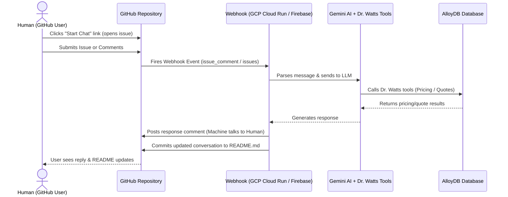

# Dr. Watts Interactive README Webhook Bot ⚡

Transform this GitHub Repository into an interactive chat interface where a **machine talks to a human** directly through GitHub Issues, dynamically updating the repository's `README.md` file with the latest conversation transcript.

---

## How It Works



1. **Human Initiates**: A user clicks the chat link in the `README.md` which opens a pre-formatted GitHub Issue.
2. **Webhook Trigger**: When the issue is opened or commented on, GitHub fires a webhook payload to our deployed Express app.
3. **Machine Processes**: The server calls the Gemini LLM with access to the local Dr. Watts database tools.
4. **Machine Responds**: The bot posts a comment back to the issue (the machine talking to the human) and commits the updated transcript to this `README.md` file.

---

## ⚡ Live Chat Status

<!-- CHAT_START -->
### Latest Conversation Transcript
*No conversations yet. Be the first to start a chat!*
<!-- CHAT_END -->

Want to chat? **[👉 Click here to start a chat with Dr. Watts AI!](https://github.com/your-username/your-repo/issues/new?title=Dr.+Watts+Chat&body=Hi%21+I+would+like+to+get+pricing+on+a+panel+upgrade.)**

---

## Webhook Server Implementation (`webhook.js`)

This Node.js code listens for GitHub webhooks, verifies signatures, runs the LLM orchestrator with Dr. Watts database tools, posts comments, and commits updates to `README.md`.

```javascript
require('dotenv').config();
const express = require('express');
const crypto = require('crypto');
const { Octokit } = require('@octokit/rest');
const { generateText, tool } = require('ai');
const { google } = require('@ai-sdk/google');
const { Pool } = require('pg');
const z = require('zod');

const app = express();
app.use(express.json({
  verify: (req, res, buf) => { req.rawBody = buf; }
}));

const octokit = new Octokit({ auth: process.env.GITHUB_TOKEN });
const pool = new Pool({ connectionString: process.env.DATABASE_URL });

// 1. Verify GitHub Webhook Signature
const verifySignature = (req) => {
  const signature = req.headers['x-hub-signature-256'];
  if (!signature) return false;
  
  const hmac = crypto.createHmac('sha256', process.env.WEBHOOK_SECRET);
  const digest = 'sha256=' + hmac.update(req.rawBody).digest('hex');
  return crypto.timingSafeEqual(Buffer.from(signature), Buffer.from(digest));
};

// 2. Database Tools for Gemini
const getServicePricing = async (serviceName) => {
  const res = await pool.query('SELECT base_price, hourly_rate FROM service_pricing WHERE service_name ILIKE $1', [`%${serviceName}%`]);
  return res.rows[0] || { error: "Service not found." };
};

const calculateQuote = async (serviceName, hours, email) => {
  const serviceRes = await pool.query('SELECT id, base_price, hourly_rate FROM service_pricing WHERE service_name ILIKE $1', [`%${serviceName}%`]);
  if (!serviceRes.rows.length) return { error: "Unknown service." };
  
  const service = serviceRes.rows[0];
  const total = Number(service.base_price) + (Number(service.hourly_rate) * hours);
  await pool.query('INSERT INTO quotes (customer_email, service_id, estimated_hours, total_price) VALUES ($1, $2, $3, $4)', [email, service.id, hours, total]);
  return { total, message: "Quote saved successfully." };
};

// 3. Webhook Endpoint
app.post('/webhook', async (req, res) => {
  if (!verifySignature(req)) {
    return res.status(401).send('Invalid signature');
  }

  const event = req.headers['x-github-event'];
  const payload = req.body;

  // We only care about new issues and issue comments with the title containing "Dr. Watts"
  const isTargetIssue = payload.issue && payload.issue.title.includes('Dr. Watts Chat');
  if (!isTargetIssue || (event !== 'issues' && event !== 'issue_comment')) {
    return res.status(200).send('Event ignored');
  }

  // Handle only newly opened issues or new comments from humans (ignore bot comments)
  if (payload.action !== 'opened' && payload.action !== 'created') return res.status(200).end();
  if (payload.sender.type === 'Bot') return res.status(200).end();

  const userMessage = event === 'issues' ? payload.issue.body : payload.comment.body;
  const issueNumber = payload.issue.number;
  const owner = payload.repository.owner.login;
  const repo = payload.repository.name;

  res.status(202).send('Accepted'); // Acknowledge webhook quickly

  try {
    // A. Run LLM with tools
    const { text } = await generateText({
      model: google('gemini-2.5-flash'),
      prompt: `A user has said: "${userMessage}". Respond to them as Dr. Watts AI Assistant. Use your service pricing and quote calculator tools when relevant. Ask for name and email before calculating a quote.`,
      tools: {
        get_service_pricing: tool({
          description: 'Get base pricing for an electrical service.',
          parameters: z.object({ serviceName: z.string() }),
          execute: async ({ serviceName }) => await getServicePricing(serviceName)
        }),
        calculate_quote: tool({
          description: 'Calculate and save quote.',
          parameters: z.object({ serviceName: z.string(), hours: z.number(), email: z.string() }),
          execute: async ({ serviceName, hours, email }) => await calculateQuote(serviceName, hours, email)
        })
      }
    });

    // B. Post response comment to GitHub Issue
    await octokit.issues.createComment({
      owner,
      repo,
      issue_number: issueNumber,
      body: `⚡ **Dr. Watts AI:**\n\n${text}`
    });

    // C. Update README.md with the latest conversation step
    await updateReadme(owner, repo, payload.sender.login, userMessage, text);

  } catch (error) {
    console.error('Failed to process webhook:', error);
  }
});

// 4. Update README.md on GitHub
const updateReadme = async (owner, repo, user, userMsg, botMsg) => {
  // Fetch README.md content
  const { data: fileData } = await octokit.repos.getContent({ owner, repo, path: 'README.md' });
  const content = Buffer.from(fileData.content, 'base64').toString('utf8');
  
  // Format the new conversation block
  const newTranscript = `
### Conversation with @${user}
* **Human:** ${userMsg}
* **Dr. Watts AI:** ${botMsg}
  `.trim();

  // Replace content between tags
  const regex = /(<!-- CHAT_START -->)([\s\S]*?)(<!-- CHAT_END -->)/g;
  const updatedContent = content.replace(regex, `$1\n${newTranscript}\n$3`);

  // Commit the file back to the repository
  await octokit.repos.createOrUpdateFileContents({
    owner,
    repo,
    path: 'README.md',
    message: `🤖 Update chat history with @${user}`,
    content: Buffer.from(updatedContent).toString('base64'),
    sha: fileData.sha
  });
};

app.listen(3000, () => console.log('Webhook server running on port 3000'));
```

---

## 🚀 Step-by-Step Deployment

### 1. Deploy the Webhook Server
Deploy the `webhook.js` Express application using **GCP Cloud Run** or **Firebase Functions**:
```bash
gcloud functions deploy drWattsGithubWebhook \
  --gen2 \
  --runtime=nodejs24 \
  --trigger-http \
  --allow-unauthenticated \
  --entry-point=app \
  --set-env-vars="GITHUB_TOKEN=your_pat,GEMINI_API_KEY=your_key,DATABASE_URL=your_db_connection,WEBHOOK_SECRET=your_secret"
```
*Take note of the resulting HTTP trigger URL.*

### 2. Configure GitHub Token & Permissions
Create a **Personal Access Token (PAT)** or a **GitHub App** on your account with these scopes:
- **Issues**: Read & Write (to comment on issues)
- **Contents**: Read & Write (to commit updates to `README.md`)

### 3. Register the Webhook in GitHub
1. Go to your GitHub repository -> **Settings** -> **Webhooks** -> **Add Webhook**.
2. **Payload URL**: Enter the Cloud Run/Firebase HTTP trigger URL.
3. **Content type**: Select `application/json`.
4. **Secret**: Enter the `WEBHOOK_SECRET` string.
5. **Which events**: Select **Let me select individual events** -> check **Issues** and **Issue comments**.
6. Click **Add Webhook** to save.

### 4. Try It Out!
Go to the `README.md` on your GitHub repository, click the chat link, and open a new issue. The AI will reply to you in seconds!
